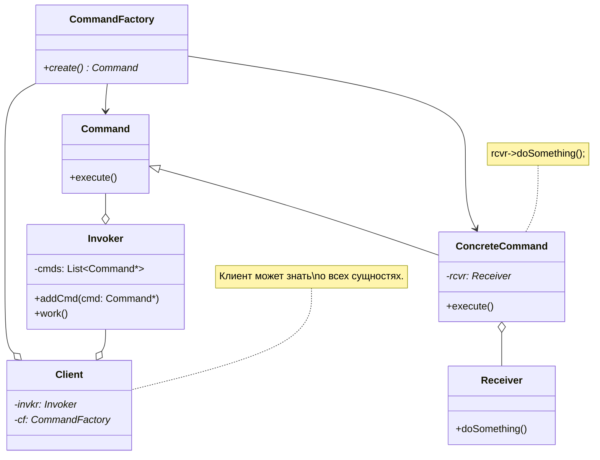

# Паттерн Command (команда) #

## **Описание** ##

Запрос (операция) - в отдельный объект-команду (экземпляр класса команды).

Такая инкапсуляция позволяет передавать этот объект *в качестве параметра* другим функциям или объектам.

### **Интерфейс** ###

Базовый класс (Command/Action/...), в самом простом случае имеет метод execute().

Что-то из источников:
> Производные классы определяют получателя (т.е. храниться ссылка на объект-получателя?).

> Переопределение метода выполнения команды (для execute() создать реализацию, которая будет вызывать другой метод).

> Метод execute() подклассов Command просто вызывает нужную операцию получателя (выше написано об этом же).

### **Участники** ###

- Клиент, создающий экземпляр командного объекта.
- Инициатор запроса, использующий командный объект.
- Получатель запроса.

---

## **Назначение** ##

- Параметризация объектов объектом-действием. Например: редактор, в котором доступны операции: *undo, redo, copy*.
- ООП аналог - для функции обратного вызова (callback).
- **Инкапсулирование запроса в виде объекта** для последующего протоколирования/логирования и т.п.
- Наделение сущности "вызов метода объекта" свойствами самостоятельного объекта.

---

## **UML-диаграмма** ##

- Команда регистрируется, чтобы быть вызванной позднее.
- Можно динамически заменять - одну команду на другую.
- Инициатор должен знать, как создать/отправить команду.
- Можно использовать сложные составные команды.

---

## **Использование** ##
- desktop-приложение c возможностями отмены и повторения действий пользователя (undo/redo).

---

## **Источники** ##

- Паттерн Command (команда) // cpp-reference URL: <http://cpp-reference.ru/patterns/behavioral-patterns/command/>.
- Паттерн проектирования «Команда» // Habr URL: <https://habr.com/ru/post/114455/>.

