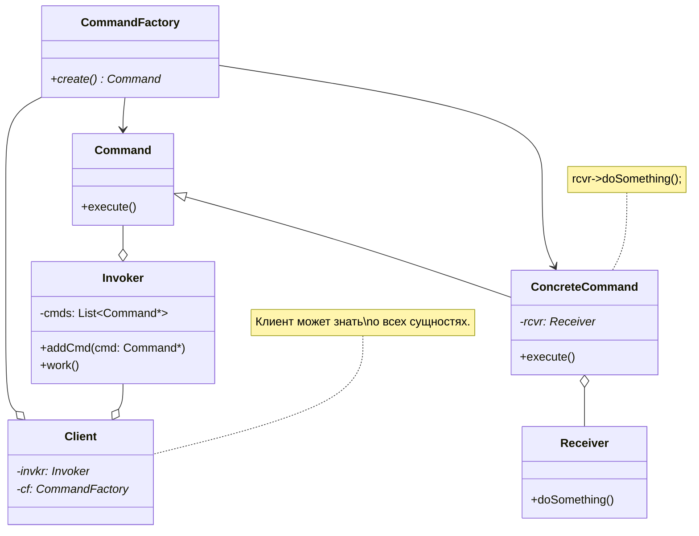

# **Паттерн Command (команда)** #

## **Описание** ##

**Запрос (операция)** - в отдельный объект-команду (экземпляр класса команды).

Такая инкапсуляция позволяет передавать этот объект *в качестве параметра* другим функциям или объектам.

### **Интерфейс и реализация** ###

Базовый класс (`Command/Action/Transaction`), в самом простом случае имеет метод `execute()`.

Из источников:
> Производные классы определяют получателя (т.е. храниться ссылка на объект-получателя?).

> Переопределение метода выполнения команды (для `execute()` создать реализацию, которая будет вызывать другой метод).

> Метод `execute()` подклассов Command, просто вызывает нужную операцию получателя (выше написано именно об этом).

### **Участники** ###

- Клиент, создающий экземпляр командного объекта (`Client`).
- Инициатор запроса, использующий командный объект напрямую (`Invoker`).
- Получатель запроса, на чьи методы делегируется вызов метода команды (`Receiver`).

---

## **Назначение** ##

- Параметризация объектов, объектом-действием. Например: редактор, в котором доступны операции: *undo, redo, copy*.
- ООП аналог - для функции обратного вызова (callback).
- **Инкапсулирование запроса в виде объекта** для последующего протоколирования/логирования и т.п.
- Наделение сущности "вызов метода объекта" свойствами самостоятельного объекта.
- Единый интерфейс для описания всех типов операций, которые можно производить с системой.

---

## **UML-диаграмма** ##

- Команда регистрируется (класс `Client` в реализации содержит `invkr->addCmd()`), чтобы быть вызванной позднее.
- Можно динамически заменять - одну команду на другую.
- Инициатор должен знать, как создать/отправить команду.
- Можно использовать сложные составные команды.

---

## **Использование** ##
- Приложение c возможностями отмены и повторения действий пользователя (undo/redo).
- Сетевые распределенные системы использующие **запросы в виде объектов** в качестве основного примитива инициализации каких-либо операций.
- Система с поддержкой асинхронных вызовов, инкапсулирующий обратный вызов в виде callback-объекта.

---

## **Источники** ##

- Паттерн Command (команда) // cpp-reference URL: <http://cpp-reference.ru/patterns/behavioral-patterns/command/>.
- Паттерн проектирования «Команда» // Habr URL: <https://habr.com/ru/post/114455/>.

