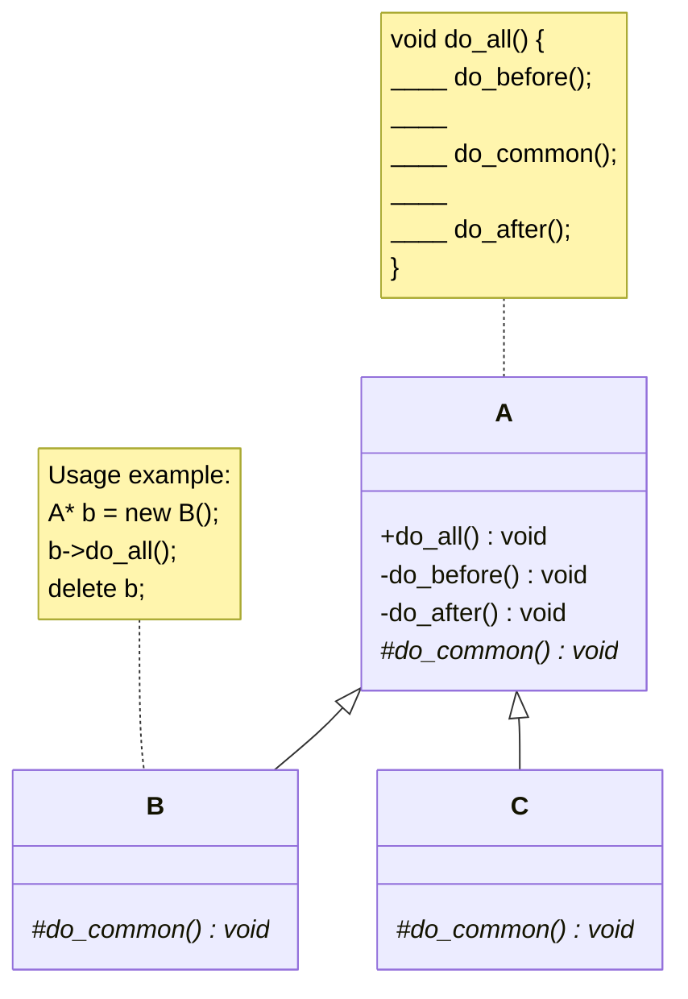

# v1 #

## **UML-диаграмма** ##

```mermaid
classDiagram
    class A {
        +do_all() void
        -do_before() void
        -do_after() void
        #do_common() void*
    }
    note for A "void do_all() {
        ____ do_before();
        ____
        ____ do_common();
        ____
        ____ do_after();
    }"

    class B {
        #do_common() void*
    }
    note for B "Usage example:
        A* b = new B();
        b->do_all();
        delete b;
    "

    class C {
        #do_common() void*
    }

    A <|-- B
    A <|-- C
```