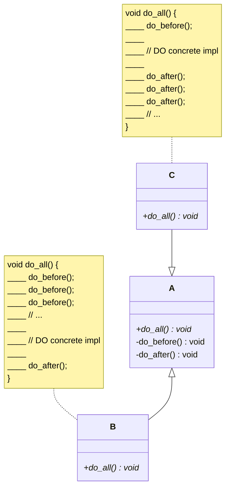

# v2 #

## **UML-диаграмма** ##

```mermaid
classDiagram
    class A {
        +do_all()* void
        -do_before() void
        -do_after() void
    }

    class B {
        +do_all()* void
    }
    note for B "void do_all() {
        ____ do_before();
        ____ do_before();
        ____ do_before();
        ____ // ...
        ____
        ____ // DO concrete impl
        ____
        ____ do_after();
    }"

    class C {
        +do_all()* void
    }
    note for C "void do_all() {
        ____ do_before();
        ____
        ____ // DO concrete impl
        ____
        ____ do_after();
        ____ do_after();
        ____ do_after();
        ____ // ...
    }"

    A <|-- B
    C --|> A
```