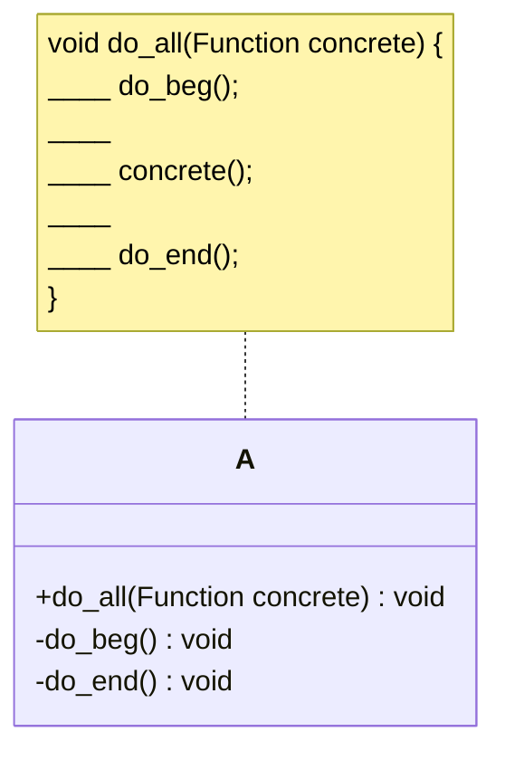

# v3 #

## **UML-диаграмма** ##

```mermaid
classDiagram
    class A {
        +do_all(Function concrete) void

        -do_beg() void
        -do_end() void
    }
    note for A "void do_all(Function concrete) {
        ____ do_beg();
        ____ 
        ____ concrete();
        ____
        ____ do_end();
    }"
```