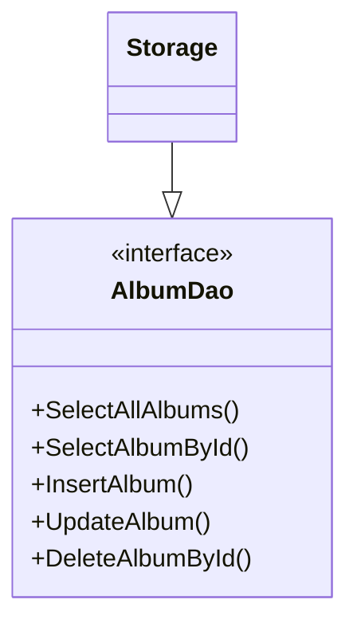

# v1

## Diagrams 📊

### Class

```mermaid
classDiagram
    class AlbumDao {
        <<interface>>
        +SelectAllAlbums()
        +SelectAlbumById()
        +InsertAlbum()
        +UpdateAlbum()
        +DeleteAlbumById()
    }

    class Storage {
        
    }

    Storage --|> AlbumDao
```

## Details

- main [here](main.go)
- Storage/Dao [here](./storage/dao.go)