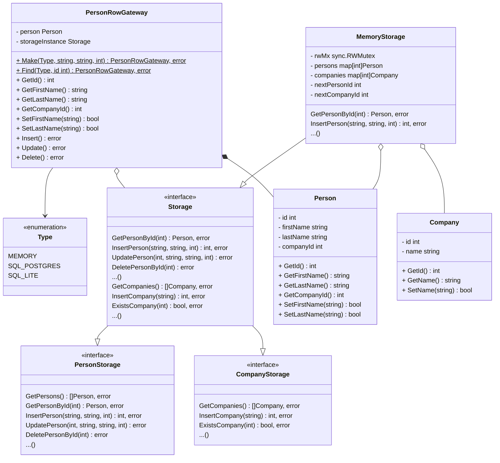

# v1

## Diagrams 📊

### Class

## Details

- main [here](main.go)
- Storage [here](./storage/storage.go)
- MemoryStorage [here](./storage/impl/memory/storage.go)
- Person [here](./domain/person.go)
- PersonRowGateway [here](./storage/gateway/row/person.go)
