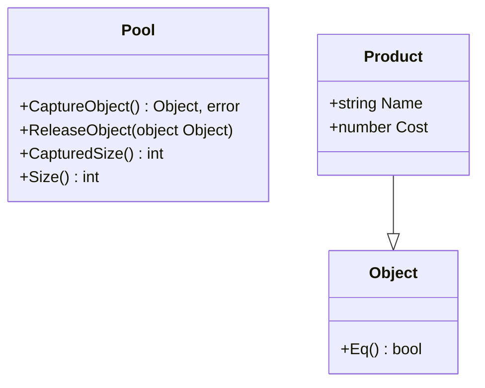

# Class

```mermaid
classDiagram
    class Object{
        +Eq() bool
    }

    class Pool{
        +CaptureObject() Object, error
        +ReleaseObject(object Object)

        +CapturedSize() int
        +Size() int
    }

    class Product{
        +string Name 
	    +number Cost 
    }

    Product --|> Object
```

# Details

- main [here](main.go)
