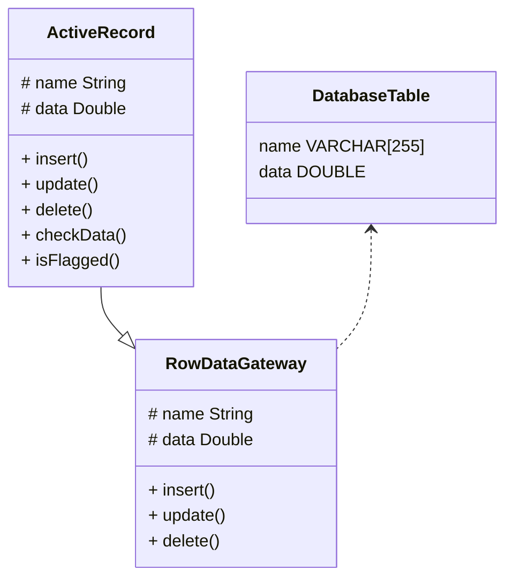

# Active Record 🧩

## Details

Каждая активная запись отвечает за сохранение и загрузку информации в базу данных, а также за логику домена, применяемую к данным.

Если очень упрощенно, каждой табличке в БД соответствует класс сущности вместе с поведением.

В простых приложениях модель предметной области представляет отнюдь не сложную структуру, которая *может содержать по одному классу домена в расчете на каждую таблицу базы данных*. Объекты таких классов часто снабжены умеренно сложной бизнес-логикой. В этом случае имеет смысл возложить на каждый из них и ответственность за ввод-вывод данных, что, по существу, равносильно применению решения активная запись `Active Record`.

При использовании паттерна `Active Record` объект класса домена осведомлен о том, как взаимодействовать с базой данных.

---

По мере усложнения бизнес-логики и возрастания значимости богатой модели предметной области простые решения типа `Active Record` начинают сдавать свои позиции.

При разнесении бизнес-логики по все более мелким классам взаимно однозначное соответствие между классами домена и таблицами базы данных постепенно теряется.

Так, решение *типа шлюза* способно устранить некоторые проблемы, но оно все еще оставляет нас с моделью предметной области, тесно привязанной к схеме базы данных.

---

Чем больше отличается реальный мир от предположения "одна табличка в БД — одна сущность предметной области", тем больше проблем с паттерном `Active Record`.

---

Объект, реализующий `Active Record`, не содержащий никакой бизнес-логики, а предоставляющий таблицу из базы данных, имеет лишь одну причину для изменения (изменение таблицы), что не противоречит определением принципа `SRP`.

## Visualization

> Это решение можно воспринимать и так, будто, начав со *шлюза записи данных*, мы добавили в класс порцию бизнес-логики.

## Examples

1. [here](./v1/NOTE.md)

## Useful Links

- Почему здравый смысл важнее паттернов, а Active Record не так уж и плох // Домклик / URL: https://habr.com/ru/companies/domclick/articles/515560/
- ActiveRecord // ВикипедиЯ / URL: https://ru.wikipedia.org/wiki/ActiveRecord
- Философия ActiveRecord // Lolka / URL: https://habr.com/ru/articles/11525/