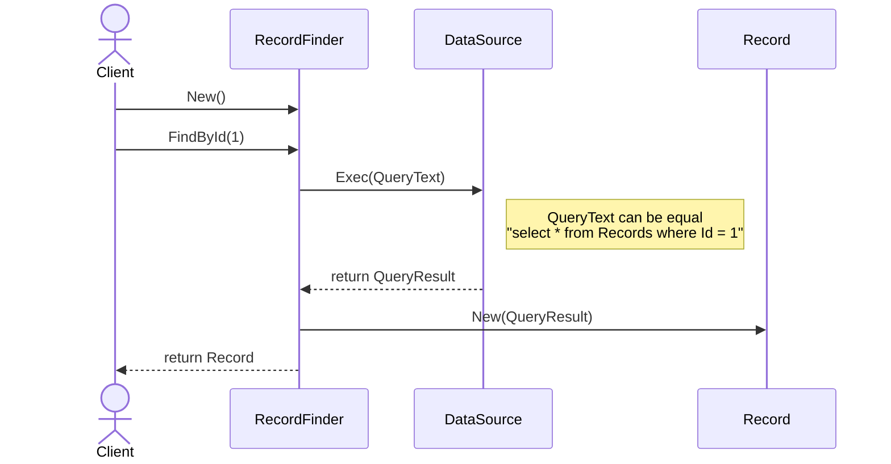

# Row Data Gateway ⛩️

## Abstract ◻

Шлюз записи данных:
- представляет собой модель, естественным образом отображающую объектно-ориентированный стиль восприятия реляционных данных;
- выступает в роли объекта, полностью повторяющего одну запись, например одну строку таблицы базы данных.

Для поиска экземпляров в источнике данных можно воспользоваться статическими методами поиска, однако такое решение исключает возможность полиморфизма. В подобной ситуации *часто* имеет смысл создать отдельные классы для поиска.

Иногда шлюз записи данных трудно отличить от `Active Record`. В этом случае следует обратить внимание на наличие какой-либо логики домена.

Если шлюз записи данных используется со сценарием транзакции, вы можете заметить, что в различных сценариях повторяется одна и та же бизнес-логика, которую можно было бы реализовать в шлюзе записи данных. *Перенос этой логики в шлюз записи данных превратит его в активную запись.*

# Useful Links

- Паттерны организации источников данных // intellect.icu / URL: https://intellect.icu/patterny-organizatsii-istochnikov-dannykh-3317?ysclid=lq29894rnx531589066