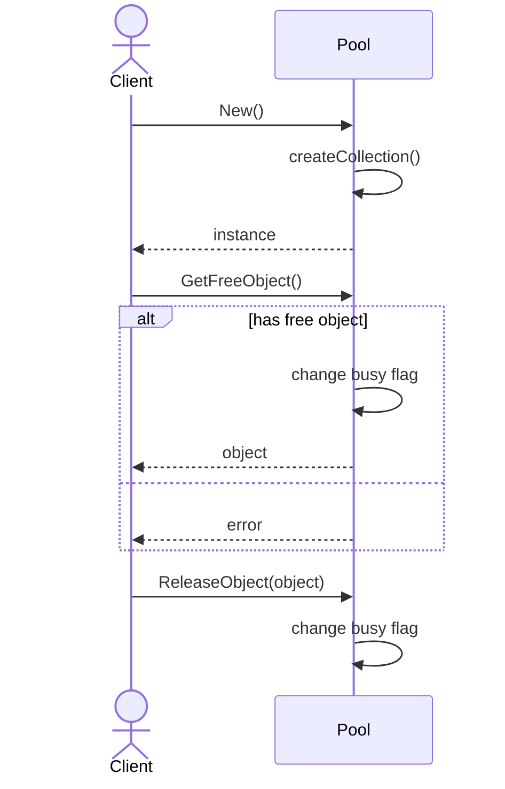

# Object Pool

## Motivation

В качестве мотивации использования этого паттерна проектирования, автор книги [1] описывает проблему *фрагментации памяти*. Такая проблема означает, что свободное место в куче разбивается на мелкие кусочки памяти вместо больших открытых блоков. Не смотря на то, что общее количество доступной памяти может оставаться большим, наибольший последовательный участок может быть ужасно маленьким.

## Concept

Ответственность за управление коллекцией объектов перекладывается на специальный класс пула объектов. Теперь каждый объект, который будет находится в пуле, необходимо пометить флагом занятости. В качестве примера объектов могут выступать подключения к базе данных или сетевые соединение.

Ниже приведена диаграмма взаимодействия с пулом объектов.

