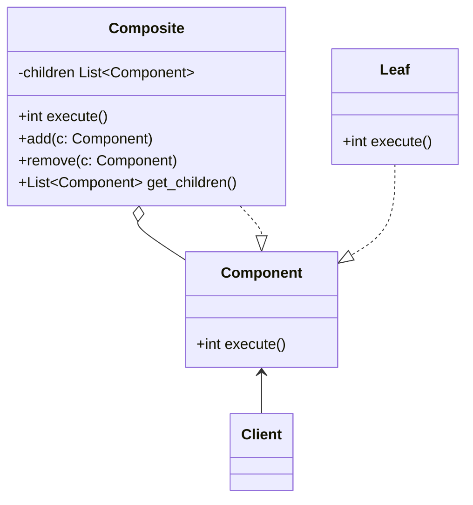

# Composite

**Компоновщик** — это структурный паттерн проектирования, который позволяет сгруппировать множество объектов в древовидную структуру, а затем работать с ней так, как будто это единичный объект.

**Компоновщик** и **Декоратор** имеют похожие структуры классов из-за того, что оба построены на рекурсивной вложенности. 

<!-- --------------------------------------------------------------------- -->

